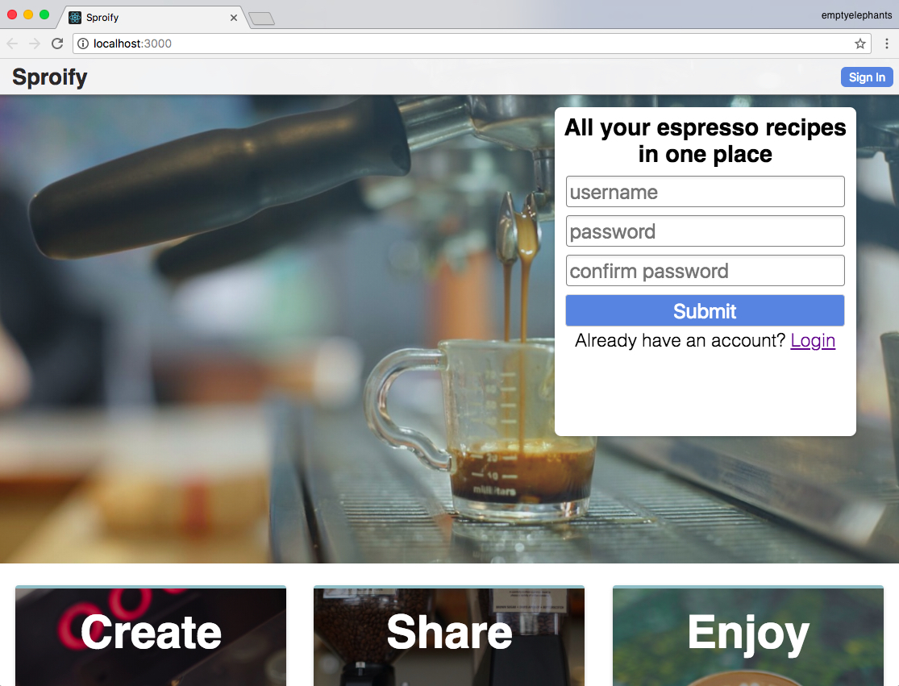

# Sproify

# Thinkful ei-18 fullstack capstone (server-side)
## What is this thing?
This is a recipe app for home and professional baristas to use to organize their espresso recipes and other general coffee related recipes. The user can create recipes using a loosely structured form, so as not to limit the user's imagination for their recipes. React is the framework used for the frontend, Redux for front end state management and Node.js and Express for the backend.

### The link to the live website is [here](http://sproify.netlify.com/)
#### use Miggy as a username and 1231231234 as a password for some example recipes.

## Tech Stack
* React
* Redux
* Node
* Express
* MongoDb
* mLab
* Heroku
* Netlify

## Landing Page

## How to run locally
1. clone repo onto your local machine
2. cd into repo and run npm install
3. run npm start
4. open localhost:3000 on your local browser

## Project structure
you can find all the components in the src folder
